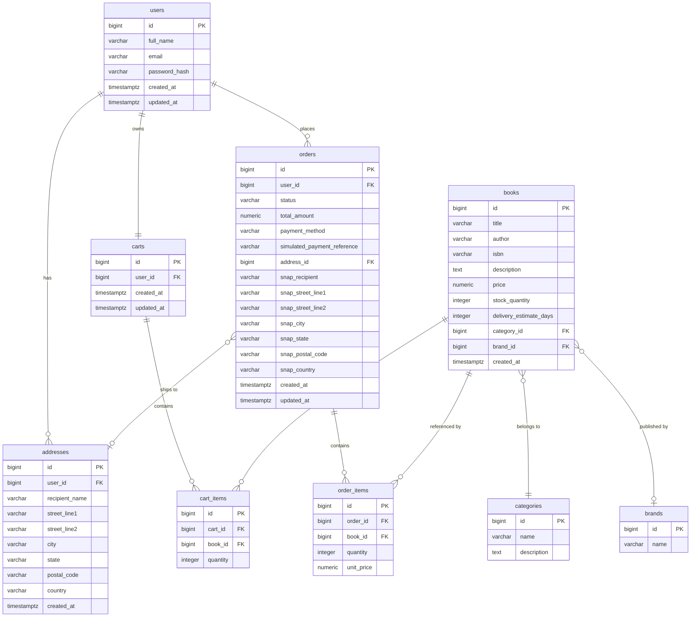

# E-Bookstore PostgreSQL Data Model Design

**Source:** `docs/requirements/requirements.md` (Status: Reviewed — Ready for Data Model Design)  
**Governing Standards:** Kiro Project Instructions  
**Phase:** 2 — Data Model Design  

---

## 1. Design Intent and Constraints

This model is designed to:

- Support the complete approved MVP journey end-to-end (browse → cart → checkout → payment simulation → order history → cancellation).
- Be the simplest correct model — no speculative columns, no enterprise-only features.
- Preserve historical pricing and delivery address data for completed orders.
- Enforce business rules at the database level where practical.
- Remain agnostic to the authentication mechanism (AM-01) — the `users` table stores credentials but does not assume JWT, session tokens, or any particular security scheme.

---

## 2. Design Decisions

The following decisions resolve open items from `requirements.md` or establish model-level choices for the first time.

### DM-01 — Brand / Publisher: Single Lookup Table

The wireframe uses "Browse the brands" as the navigational capability. The terms brand and publisher describe the same grouping concept in this bookstore context. A single `brands` table avoids repeating publisher strings on every book row and supports browse-by-brand. No separate publisher table is created.

### DM-02 — No Separate Payments Table

The approved workflow is:

> Cart + Address → Simulate Payment → If Successful → Create Confirmed Order

An order is created only after successful simulated payment. Failed payment attempts produce a response to the caller but result in no persisted record. There is therefore no need to persist PENDING or FAILED payment rows.

The minimum non-sensitive payment information required for a completed purchase — `payment_method` and `simulated_payment_reference` — is stored directly on the `orders` table. No card numbers, CVVs, expiration dates, bank information, or real payment tokens are stored anywhere.

### DM-03 — Order Address Snapshotting

Address fields are snapshotted directly onto the `orders` table at the moment of order creation. This guarantees that order history always reflects the exact delivery address used, regardless of any subsequent edits to the customer's saved addresses. The nullable FK `orders.address_id` is retained for traceability but the `snap_*` columns are the authoritative record for display.

### DM-04 — Delivery Estimate as Integer Days

A column `delivery_estimate_days INTEGER` is stored on the `books` table. The value represents simple calendar days. The API layer adds this integer to the purchase date to produce the estimated delivery date shown to the customer. No business-day logic, weekend handling, or holiday calendars are introduced. No arbitrary default value is prescribed; the value is set per book when catalogue data is loaded.

### DM-05 — Catalogue Data Loading Deferred

Demonstration catalogue data (categories, brands, books) will be required for the running application. The mechanism for loading that data — SQL script, Spring Boot initialiser, Flyway migration, or another approach — will be selected during the PostgreSQL / local-run phase. No loading strategy is chosen here.

### DM-06 — One Reusable Cart Per Customer

Each customer has exactly one cart, enforced by `UNIQUE(user_id)` on `carts`. The cart is not statused. After a successful checkout, cart items are cleared by the service layer, and the same cart row is reused for the customer's next shopping session. No historical cart records are maintained.

### DM-07 — No Duplicate Books in a Cart

A `UNIQUE(cart_id, book_id)` constraint on `cart_items` prevents the same book appearing on more than one row. When the customer adds a book already in the cart, the service layer increments the existing row's quantity.

### DM-08 — Order Lifecycle: Two Statuses Only

Orders are created directly in `CONFIRMED` status after successful simulated payment. The only permitted transition is:

`CONFIRMED → CANCELLED`

Cancellation is permitted only when the 48-hour cancellation rule is satisfied (BR-07). No `PENDING` status exists.

### DM-09 — Primary Key Strategy

All tables use `BIGINT GENERATED BY DEFAULT AS IDENTITY` as the surrogate primary key. This is the modern SQL-standard equivalent of a serial sequence, compatible with Spring Data JPA using `@GeneratedValue(strategy = GenerationType.IDENTITY)`, and avoids the PostgreSQL-specific `BIGSERIAL` shorthand. Table and column names use `snake_case` throughout.

---

## 3. Tables and Attributes

### 3.1 `users`

Stores registered customer accounts. The authentication mechanism is not prescribed by this model.

| Column          | Type                       | Constraints             | Notes                                 |
|-----------------|----------------------------|-------------------------|---------------------------------------|
| `id`            | `BIGINT GENERATED BY DEFAULT AS IDENTITY` | PRIMARY KEY | Surrogate key (DM-09)   |
| `full_name`     | `VARCHAR(255)`             | NOT NULL                |                                       |
| `email`         | `VARCHAR(255)`             | NOT NULL, UNIQUE        | Enforces BR-10                        |
| `password_hash` | `VARCHAR(255)`             | NOT NULL                | BCrypt hash; never plaintext (NFR-03) |
| `created_at`    | `TIMESTAMP WITH TIME ZONE` | NOT NULL, DEFAULT NOW() |                                       |
| `updated_at`    | `TIMESTAMP WITH TIME ZONE` | NOT NULL, DEFAULT NOW() |                                       |

---

### 3.2 `categories`

Lookup table for book categories (e.g. Fiction, Science, Biography). Populated with demonstration data before use.

| Column        | Type           | Constraints      | Notes |
|---------------|----------------|------------------|-------|
| `id`          | `BIGINT GENERATED BY DEFAULT AS IDENTITY` | PRIMARY KEY | |
| `name`        | `VARCHAR(100)` | NOT NULL, UNIQUE |       |
| `description` | `TEXT`         |                  |       |

---

### 3.3 `brands`

Represents the publisher / brand grouping used by the bookstore's "Browse Brands" capability (FR-02.4). Populated with demonstration data before use.

| Column | Type           | Constraints      | Notes |
|--------|----------------|------------------|-------|
| `id`   | `BIGINT GENERATED BY DEFAULT AS IDENTITY` | PRIMARY KEY | |
| `name` | `VARCHAR(255)` | NOT NULL, UNIQUE |       |

---

### 3.4 `books`

The product catalogue. Each row represents one book title available for purchase.

| Column                    | Type                       | Constraints                              | Notes                                            |
|---------------------------|----------------------------|------------------------------------------|--------------------------------------------------|
| `id`                      | `BIGINT GENERATED BY DEFAULT AS IDENTITY` | PRIMARY KEY              |                                                  |
| `title`                   | `VARCHAR(500)`             | NOT NULL                                 |                                                  |
| `author`                  | `VARCHAR(255)`             | NOT NULL                                 |                                                  |
| `isbn`                    | `VARCHAR(20)`              | UNIQUE                                   | Nullable; unique when present                    |
| `description`             | `TEXT`                     |                                          |                                                  |
| `price`                   | `NUMERIC(10,2)`            | NOT NULL, CHECK (`price` >= 0)           |                                                  |
| `stock_quantity`          | `INTEGER`                  | NOT NULL, DEFAULT 0, CHECK (`stock_quantity` >= 0) | Decremented on order; restored on cancellation (AM-08) |
| `delivery_estimate_days`  | `INTEGER`                  | NOT NULL, CHECK (`delivery_estimate_days` > 0) | Calendar days; added to purchase date at API layer (DM-04) |
| `category_id`             | `BIGINT`                   | NOT NULL, FK → `categories(id)`          |                                                  |
| `brand_id`                | `BIGINT`                   | FK → `brands(id)`                        | Nullable — book may have no associated brand     |
| `created_at`              | `TIMESTAMP WITH TIME ZONE` | NOT NULL, DEFAULT NOW()                  |                                                  |

---

### 3.5 `addresses`

Customer delivery addresses (FR-04). Physical deletion is safe because historical order address information is preserved by the `orders` address snapshot.

| Column           | Type                       | Constraints                         | Notes                               |
|------------------|----------------------------|-------------------------------------|-------------------------------------|
| `id`             | `BIGINT GENERATED BY DEFAULT AS IDENTITY` | PRIMARY KEY          |                                     |
| `user_id`        | `BIGINT`                   | NOT NULL, FK → `users(id)`          |                                     |
| `recipient_name` | `VARCHAR(255)`             | NOT NULL                            |                                     |
| `street_line1`   | `VARCHAR(255)`             | NOT NULL                            |                                     |
| `street_line2`   | `VARCHAR(255)`             |                                     | Nullable                            |
| `city`           | `VARCHAR(100)`             | NOT NULL                            |                                     |
| `state`          | `VARCHAR(100)`             | NOT NULL                            |                                     |
| `postal_code`    | `VARCHAR(20)`              | NOT NULL                            |                                     |
| `country`        | `VARCHAR(100)`             | NOT NULL                            |                                     |
| `created_at`     | `TIMESTAMP WITH TIME ZONE` | NOT NULL, DEFAULT NOW()             |                                     |

---

### 3.6 `carts`

One reusable cart per customer (BR-01, BR-02, DM-06). Cart items are cleared after successful checkout; the cart row itself is retained and reused.

| Column       | Type                       | Constraints                      | Notes                         |
|--------------|----------------------------|----------------------------------|-------------------------------|
| `id`         | `BIGINT GENERATED BY DEFAULT AS IDENTITY` | PRIMARY KEY       |                               |
| `user_id`    | `BIGINT`                   | NOT NULL, UNIQUE, FK → `users(id)` | UNIQUE enforces one cart per user (DM-06) |
| `created_at` | `TIMESTAMP WITH TIME ZONE` | NOT NULL, DEFAULT NOW()          |                               |
| `updated_at` | `TIMESTAMP WITH TIME ZONE` | NOT NULL, DEFAULT NOW()          | Updated when items change     |

---

### 3.7 `cart_items`

Line items within a cart. Unique per book per cart (DM-07).

| Column     | Type      | Constraints                           | Notes                                           |
|------------|-----------|---------------------------------------|-------------------------------------------------|
| `id`       | `BIGINT GENERATED BY DEFAULT AS IDENTITY` | PRIMARY KEY         |                                                 |
| `cart_id`  | `BIGINT`  | NOT NULL, FK → `carts(id)`            | ON DELETE CASCADE                               |
| `book_id`  | `BIGINT`  | NOT NULL, FK → `books(id)`            | ON DELETE RESTRICT                              |
| `quantity` | `INTEGER` | NOT NULL, CHECK (`quantity` > 0)      |                                                 |

**Unique constraint:** `UNIQUE (cart_id, book_id)` — prevents the same book appearing twice in a cart (DM-07).

---

### 3.8 `orders`

Confirmed orders. Created in `CONFIRMED` status after successful simulated payment. Includes an address snapshot and minimum non-sensitive payment information (DM-02, DM-03, DM-08).

| Column                       | Type                       | Constraints                          | Notes                                                        |
|------------------------------|----------------------------|--------------------------------------|--------------------------------------------------------------|
| `id`                         | `BIGINT GENERATED BY DEFAULT AS IDENTITY` | PRIMARY KEY           |                                                              |
| `user_id`                    | `BIGINT`                   | NOT NULL, FK → `users(id)`           | ON DELETE RESTRICT                                           |
| `status`                     | `VARCHAR(20)`              | NOT NULL, DEFAULT 'CONFIRMED'        | Values: `CONFIRMED`, `CANCELLED` (DM-08)                     |
| `total_amount`               | `NUMERIC(10,2)`            | NOT NULL, CHECK (`total_amount` >= 0)|                                                              |
| `payment_method`             | `VARCHAR(20)`              | NOT NULL                             | `CREDIT_CARD` or `DEBIT_CARD`; no card credentials stored (BR-08, DM-02) |
| `simulated_payment_reference`| `VARCHAR(100)`             |                                      | Generated reference code; not a real payment token (DM-02)   |
| `address_id`                 | `BIGINT`                   | FK → `addresses(id)`                 | Nullable; ON DELETE SET NULL; snapshot is authoritative (DM-03) |
| `snap_recipient`             | `VARCHAR(255)`             | NOT NULL                             | Address snapshot — recipient name                            |
| `snap_street_line1`          | `VARCHAR(255)`             | NOT NULL                             | Address snapshot — street line 1                             |
| `snap_street_line2`          | `VARCHAR(255)`             |                                      | Address snapshot — street line 2 (nullable)                  |
| `snap_city`                  | `VARCHAR(100)`             | NOT NULL                             | Address snapshot — city                                      |
| `snap_state`                 | `VARCHAR(100)`             | NOT NULL                             | Address snapshot — state / province                          |
| `snap_postal_code`           | `VARCHAR(20)`              | NOT NULL                             | Address snapshot — postal code                               |
| `snap_country`               | `VARCHAR(100)`             | NOT NULL                             | Address snapshot — country                                   |
| `created_at`                 | `TIMESTAMP WITH TIME ZONE` | NOT NULL, DEFAULT NOW()              | Basis for 48-hour cancellation window (BR-07)                |
| `updated_at`                 | `TIMESTAMP WITH TIME ZONE` | NOT NULL, DEFAULT NOW()              | Updated on status change                                     |

---

### 3.9 `order_items`

Line items for a confirmed order. Unit price is locked at the time of purchase (BR-06).

| Column       | Type            | Constraints                           | Notes                                            |
|--------------|-----------------|---------------------------------------|--------------------------------------------------|
| `id`         | `BIGINT GENERATED BY DEFAULT AS IDENTITY` | PRIMARY KEY         |                                                  |
| `order_id`   | `BIGINT`        | NOT NULL, FK → `orders(id)`           | ON DELETE RESTRICT — protects completed order history |
| `book_id`    | `BIGINT`        | NOT NULL, FK → `books(id)`            | ON DELETE RESTRICT                               |
| `quantity`   | `INTEGER`       | NOT NULL, CHECK (`quantity` > 0)      |                                                  |
| `unit_price` | `NUMERIC(10,2)` | NOT NULL, CHECK (`unit_price` >= 0)   | Snapshot of `books.price` at checkout (BR-06)    |

---

## 4. Relationships and Cardinalities

| Relationship              | Cardinality | Notes                                                          |
|---------------------------|-------------|----------------------------------------------------------------|
| `users` → `addresses`     | 1 : many    | A user can have many saved delivery addresses                  |
| `users` → `carts`         | 1 : 1       | Enforced by `UNIQUE(user_id)` on `carts` (DM-06)              |
| `users` → `orders`        | 1 : many    | A user can place many orders over time                         |
| `carts` → `cart_items`    | 1 : many    | A cart has zero or more line items                             |
| `cart_items` → `books`    | many : 1    | Each cart item references one book                             |
| `orders` → `order_items`  | 1 : many    | An order has one or more line items                            |
| `order_items` → `books`   | many : 1    | Each order item references one book                            |
| `orders` → `addresses`    | many : 1    | Nullable FK; `snap_*` columns are the authoritative record     |
| `books` → `categories`    | many : 1    | Each book belongs to one category                              |
| `books` → `brands`        | many : 1    | Each book optionally belongs to one brand/publisher            |

---

## 5. Foreign Key Delete Behaviour

| FK Column                  | ON DELETE    | Rationale                                                                   |
|----------------------------|--------------|-----------------------------------------------------------------------------|
| `addresses.user_id`        | RESTRICT     | Prevent user deletion while saved addresses exist                           |
| `cart_items.cart_id`       | CASCADE      | Deleting a cart removes its items automatically                             |
| `cart_items.book_id`       | RESTRICT     | A book referenced in a cart must not be deleted                             |
| `carts.user_id`            | RESTRICT     | Prevent user deletion while a cart exists                                   |
| `orders.user_id`           | RESTRICT     | Prevent user deletion while order history exists                            |
| `orders.address_id`        | SET NULL     | Nullable FK; if an address is hard-deleted, the FK becomes NULL — snapshot fields remain authoritative |
| `order_items.order_id`     | RESTRICT     | Protect completed order history; no MVP API for deleting orders             |
| `order_items.book_id`      | RESTRICT     | A book referenced in a completed order must not be deleted                  |
| `books.category_id`        | RESTRICT     | A category referenced by books must not be deleted                          |
| `books.brand_id`           | SET NULL     | Nullable FK; if a brand is removed, book becomes unbranded                  |

---

## 6. Constraints Summary

| Table        | Constraint Type | Columns / Expression            | Purpose                                     |
|--------------|-----------------|---------------------------------|---------------------------------------------|
| `users`      | UNIQUE          | `email`                         | One account per email address (BR-10)       |
| `books`      | CHECK           | `price >= 0`                    | Non-negative price                          |
| `books`      | CHECK           | `stock_quantity >= 0`           | Non-negative stock (AM-08)                  |
| `books`      | CHECK           | `delivery_estimate_days > 0`    | Positive delivery estimate (DM-04)          |
| `carts`      | UNIQUE          | `user_id`                       | One cart per customer (DM-06, BR-02)        |
| `cart_items` | UNIQUE          | `(cart_id, book_id)`            | No duplicate book in a cart (DM-07)         |
| `cart_items` | CHECK           | `quantity > 0`                  | Positive quantity                           |
| `orders`     | CHECK           | `total_amount >= 0`             | Non-negative order total                    |
| `order_items`| CHECK           | `quantity > 0`                  | Positive quantity                           |
| `order_items`| CHECK           | `unit_price >= 0`               | Non-negative historical price               |

---

## 7. Recommended Indexes

Only indexes that directly support access patterns required by the approved MVP are included.

| Table        | Index Columns          | Type   | Justification                                                   |
|--------------|------------------------|--------|-----------------------------------------------------------------|
| `users`      | `email`                | UNIQUE | Login lookup (FR-01.2); covered by the UNIQUE constraint        |
| `books`      | `category_id`          | B-TREE | Browse books by category (FR-02.2, US-05)                       |
| `books`      | `brand_id`             | B-TREE | Browse books by brand (FR-02.4, US-06)                          |
| `addresses`  | `user_id`              | B-TREE | List a customer's saved addresses (FR-04.1)                     |
| `carts`      | `user_id`              | UNIQUE | Retrieve a customer's cart; covered by the UNIQUE constraint (DM-06) |
| `cart_items` | `cart_id`              | B-TREE | List items in a cart (FR-03.2)                                  |
| `orders`     | `(user_id, created_at)`| B-TREE | Order history per user, ordered by date (FR-08.1, FR-08.2)     |
| `order_items`| `order_id`             | B-TREE | Retrieve line items for a specific order (FR-08.3)              |

**Search note:** Keyword search on the catalogue (FR-02.6) will use straightforward case-insensitive matching at the application layer for the demonstration-scale MVP. No full-text search index, trigram extension, or external search service is introduced.

---

## 8. Audit Timestamps

| Table        | `created_at` | `updated_at` | Notes                                            |
|--------------|:------------:|:------------:|--------------------------------------------------|
| `users`      | ✓            | ✓            |                                                  |
| `categories` | —            | —            | Reference data; timestamps not required for MVP  |
| `brands`     | —            | —            | Reference data; timestamps not required for MVP  |
| `books`      | ✓            | —            | Catalogue is append-style for MVP                |
| `addresses`  | ✓            | —            | No soft-delete column; physical delete is safe   |
| `carts`      | ✓            | ✓            | `updated_at` reflects last item change           |
| `cart_items` | —            | —            | Covered by parent cart `updated_at`              |
| `orders`     | ✓            | ✓            | `updated_at` reflects status changes             |
| `order_items`| —            | —            | Covered by parent order `created_at`             |

---

## 9. ER Diagram

---

## 10. Data Dictionary

### `users`
Registered customer accounts. Authentication mechanism is not prescribed by this model.

| Column          | Type                     | Nullable | Description                                    |
|-----------------|--------------------------|----------|------------------------------------------------|
| `id`            | BIGINT IDENTITY          | No       | Surrogate primary key                          |
| `full_name`     | VARCHAR(255)             | No       | Customer's full name                           |
| `email`         | VARCHAR(255)             | No       | Unique login identifier (BR-10)                |
| `password_hash` | VARCHAR(255)             | No       | BCrypt-hashed password; never plaintext (NFR-03)|
| `created_at`    | TIMESTAMP WITH TIME ZONE | No       | Account creation timestamp                     |
| `updated_at`    | TIMESTAMP WITH TIME ZONE | No       | Last profile update timestamp                  |

---

### `categories`
Reference data for book categories. Populated with demonstration data before use.

| Column        | Type         | Nullable | Description                      |
|---------------|--------------|----------|----------------------------------|
| `id`          | BIGINT IDENTITY | No    | Surrogate primary key            |
| `name`        | VARCHAR(100) | No       | Category name; must be unique    |
| `description` | TEXT         | Yes      | Optional description             |

---

### `brands`
Publisher / brand grouping supporting the "Browse Brands" capability (FR-02.4). Populated with demonstration data before use.

| Column | Type         | Nullable | Description                     |
|--------|--------------|----------|---------------------------------|
| `id`   | BIGINT IDENTITY | No    | Surrogate primary key           |
| `name` | VARCHAR(255) | No       | Brand/publisher name; must be unique |

---

### `books`
Product catalogue. One row per book title available for purchase.

| Column                   | Type                     | Nullable | Description                                                         |
|--------------------------|--------------------------|----------|---------------------------------------------------------------------|
| `id`                     | BIGINT IDENTITY          | No       | Surrogate primary key                                               |
| `title`                  | VARCHAR(500)             | No       | Book title                                                          |
| `author`                 | VARCHAR(255)             | No       | Author name(s)                                                      |
| `isbn`                   | VARCHAR(20)              | Yes      | ISBN-10 or ISBN-13; unique when present                             |
| `description`            | TEXT                     | Yes      | Book synopsis / description                                         |
| `price`                  | NUMERIC(10,2)            | No       | Retail price; must be ≥ 0                                           |
| `stock_quantity`         | INTEGER                  | No       | Available units; decremented on order, restored on cancellation     |
| `delivery_estimate_days` | INTEGER                  | No       | Calendar days to delivery; API layer adds to purchase date (DM-04) |
| `category_id`            | BIGINT (FK)              | No       | References `categories.id`                                          |
| `brand_id`               | BIGINT (FK)              | Yes      | References `brands.id`; nullable (book may have no brand)           |
| `created_at`             | TIMESTAMP WITH TIME ZONE | No       | Row creation timestamp                                              |

---

### `addresses`
Customer delivery addresses. Physical deletion is safe; historical address data is preserved by the order snapshot.

| Column           | Type                     | Nullable | Description                             |
|------------------|--------------------------|----------|-----------------------------------------|
| `id`             | BIGINT IDENTITY          | No       | Surrogate primary key                   |
| `user_id`        | BIGINT (FK)              | No       | References `users.id`                   |
| `recipient_name` | VARCHAR(255)             | No       | Name on delivery label                  |
| `street_line1`   | VARCHAR(255)             | No       | Primary street address line             |
| `street_line2`   | VARCHAR(255)             | Yes      | Apartment, suite, unit, etc.            |
| `city`           | VARCHAR(100)             | No       | City                                    |
| `state`          | VARCHAR(100)             | No       | State or province                       |
| `postal_code`    | VARCHAR(20)              | No       | Postal / ZIP code                       |
| `country`        | VARCHAR(100)             | No       | Country                                 |
| `created_at`     | TIMESTAMP WITH TIME ZONE | No       | Row creation timestamp                  |

---

### `carts`
One reusable cart per customer. Items are cleared after checkout; the cart row is retained (DM-06).

| Column       | Type                     | Nullable | Description                                         |
|--------------|--------------------------|----------|-----------------------------------------------------|
| `id`         | BIGINT IDENTITY          | No       | Surrogate primary key                               |
| `user_id`    | BIGINT (FK)              | No       | References `users.id`; UNIQUE — one cart per user   |
| `created_at` | TIMESTAMP WITH TIME ZONE | No       | Cart creation timestamp                             |
| `updated_at` | TIMESTAMP WITH TIME ZONE | No       | Last item change timestamp                          |

---

### `cart_items`
Line items within a cart. One row per book per cart.

| Column     | Type            | Nullable | Description                                    |
|------------|-----------------|----------|------------------------------------------------|
| `id`       | BIGINT IDENTITY | No       | Surrogate primary key                          |
| `cart_id`  | BIGINT (FK)     | No       | References `carts.id`; ON DELETE CASCADE       |
| `book_id`  | BIGINT (FK)     | No       | References `books.id`; ON DELETE RESTRICT      |
| `quantity` | INTEGER         | No       | Number of copies in the cart; must be > 0      |

---

### `orders`
Confirmed orders. Created in `CONFIRMED` status after successful simulated payment. Contains address snapshot and non-sensitive payment information.

| Column                        | Type                     | Nullable | Description                                                        |
|-------------------------------|--------------------------|----------|--------------------------------------------------------------------|
| `id`                          | BIGINT IDENTITY          | No       | Surrogate primary key                                              |
| `user_id`                     | BIGINT (FK)              | No       | References `users.id`; ON DELETE RESTRICT                          |
| `status`                      | VARCHAR(20)              | No       | `CONFIRMED` or `CANCELLED` (DM-08)                                 |
| `total_amount`                | NUMERIC(10,2)            | No       | Order total at time of checkout; must be ≥ 0                       |
| `payment_method`              | VARCHAR(20)              | No       | `CREDIT_CARD` or `DEBIT_CARD`; no card credentials stored (BR-08) |
| `simulated_payment_reference` | VARCHAR(100)             | Yes      | Generated reference code; not a real payment token (DM-02)         |
| `address_id`                  | BIGINT (FK)              | Yes      | References `addresses.id`; ON DELETE SET NULL; snapshot is authoritative |
| `snap_recipient`              | VARCHAR(255)             | No       | Address snapshot — recipient name at time of order                 |
| `snap_street_line1`           | VARCHAR(255)             | No       | Address snapshot — street line 1                                   |
| `snap_street_line2`           | VARCHAR(255)             | Yes      | Address snapshot — street line 2                                   |
| `snap_city`                   | VARCHAR(100)             | No       | Address snapshot — city                                            |
| `snap_state`                  | VARCHAR(100)             | No       | Address snapshot — state / province                                |
| `snap_postal_code`            | VARCHAR(20)              | No       | Address snapshot — postal code                                     |
| `snap_country`                | VARCHAR(100)             | No       | Address snapshot — country                                         |
| `created_at`                  | TIMESTAMP WITH TIME ZONE | No       | Order creation timestamp; basis for 48-hour cancellation (BR-07)  |
| `updated_at`                  | TIMESTAMP WITH TIME ZONE | No       | Last status change timestamp                                       |

---

### `order_items`
Line items for a confirmed order. Unit price locked at time of purchase (BR-06).

| Column       | Type            | Nullable | Description                                              |
|--------------|-----------------|----------|----------------------------------------------------------|
| `id`         | BIGINT IDENTITY | No       | Surrogate primary key                                    |
| `order_id`   | BIGINT (FK)     | No       | References `orders.id`; ON DELETE RESTRICT               |
| `book_id`    | BIGINT (FK)     | No       | References `books.id`; ON DELETE RESTRICT                |
| `quantity`   | INTEGER         | No       | Number of copies ordered; must be > 0                    |
| `unit_price` | NUMERIC(10,2)   | No       | Snapshot of `books.price` at checkout (BR-06); must be ≥ 0 |

---

## 11. Requirements Traceability

| Table / Design Decision             | Requirement(s) Satisfied                                                |
|-------------------------------------|-------------------------------------------------------------------------|
| `users`                             | FR-01.1, FR-01.2, FR-01.3, FR-01.4, NFR-03, BR-10                     |
| `categories`                        | FR-02.2, US-05                                                          |
| `brands`                            | FR-02.4, US-06; DM-01                                                   |
| `books`                             | FR-02.1–FR-02.6, US-04–US-09, BR-03, AM-08                             |
| `books.delivery_estimate_days`      | FR-02.3, US-09; AM-06 resolved by DM-04                                 |
| `books.stock_quantity`              | BR-03, AM-08                                                            |
| `books.price`                       | FR-02.3, FR-05.3                                                        |
| `addresses`                         | FR-04.1–FR-04.3, US-14                                                  |
| `carts`                             | FR-03.1–FR-03.5, BR-01, BR-02; DM-06                                   |
| `cart_items`                        | FR-03.1–FR-03.4; DM-07                                                  |
| `orders`                            | FR-05, FR-07, FR-08, FR-09, BR-04, BR-05, BR-07, BR-09; DM-08          |
| `orders.payment_method`             | FR-06.1, BR-08; DM-02                                                   |
| `orders.simulated_payment_reference`| FR-07.2; DM-02                                                          |
| `orders.snap_*`                     | FR-07.1, FR-08.2; DM-03                                                 |
| `orders.created_at`                 | FR-09.1, FR-09.2, BR-07                                                 |
| `orders.status`                     | FR-08.2, FR-09.3; DM-08                                                 |
| `orders.total_amount`               | FR-05.3, FR-07.1, FR-08.2                                               |
| `order_items`                       | FR-07.1, FR-08.2, FR-08.3, BR-06                                        |
| `order_items.unit_price`            | BR-06 — purchase price preserved independently of `books.price`         |
| BIGINT IDENTITY PKs                 | NFR-06; DM-09                                                           |
| FK constraints, CHECK, UNIQUE       | NFR-06                                                                  |
| Indexes (Section 7)                 | NFR-06, FR-02.2, FR-02.4, FR-08.1, FR-08.3                             |

---

**Status: Reviewed — Ready for API Design**
